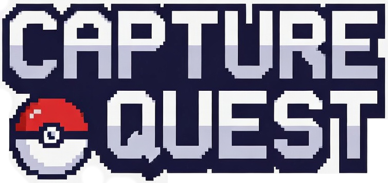
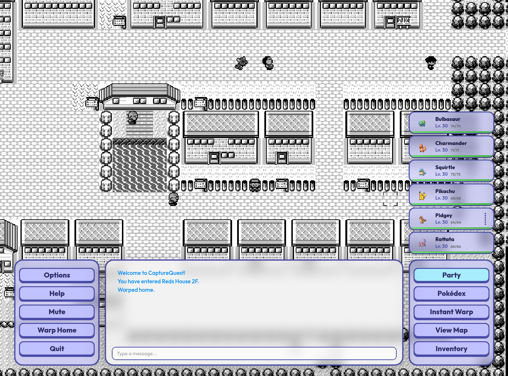

<p align="center">
  
</p>

CaptureQuest is an MMO based on the original Pokémon GameBoy games from 1996. It uses data extracted directly from the original game cartridges and source-derived project data to rebuild Kanto as a multiplayer world, with a Go server authoritatively managing gameplay state and a Phaser/TypeScript client rendering the experience. The project aims to preserve the shape of the Red/Blue adventure while adding MMO-style persistence, chat, shared spaces, scripted events, expanded world systems, and eventually player-driven features like land ownership and dynamic map growth.

<h2 align="center">
  <a href="https://capturequest.net/">Play it now!</a>
</h2>

<p align="center">
  
</p>

## Fresh Local Bootstrap

CaptureQuest's raw Pokémon data comes from the bundled extractor submodule,
[`pokemon-gameboy-extractor-tool`](https://github.com/brynnb/pokemon-gameboy-extractor-tool).
That public tool turns the cartridge/source data into generated maps, tiles,
sprites, script candidates, and a SQLite artifact named `pokemon.db`.
CaptureQuest imports those generated outputs into its runtime asset folders and
Postgres database instead of depending on private local database state or
committed generated assets.

For a clean checkout, clone with submodules and run the CaptureQuest bootstrap:

```bash
git clone --recurse-submodules https://github.com/brynnb/capture-quest.git
cd capture-quest
npm run bootstrap:fresh
npm run dev:all
```

If you cloned without submodules, run:

```bash
git submodule update --init --recursive
```

`npm run bootstrap:fresh` initializes the extractor submodule, runs the
extractor pipeline, syncs generated assets into `public/`, imports generated
script JSON, applies the flattened Postgres schema, imports the SQLite data,
runs database smoke checks, generates audio manifests, and refreshes generated
TypeScript API bindings. It defaults to `--create --reset`; pass bootstrap
script args after `--` if you need a different database mode.

The asset sync fetches 96x96 Pokémon battle sprites from PokeAPI during
bootstrap when network access is available, falling back to extractor-rendered
sprites if needed.

To regenerate only files and assets without touching Postgres:

```bash
npm run bootstrap:assets
```

The bootstrap validates the extractor artifact before copying it. The SQLite
file must contain both usable tile data and generated script-event tables; if
`tiles` or `tile_images` are empty, install RGBDS so the extractor can run
`rgbgfx`, then rerun `npm run bootstrap:assets`.

If you want to use an external extractor checkout instead of the submodule, set
`POKEMON_EXTRACTOR_ROOT=/path/to/pokemon-gameboy-extractor-tool` or
`POKEMON_DB_SOURCE=/path/to/pokemon.db`.
